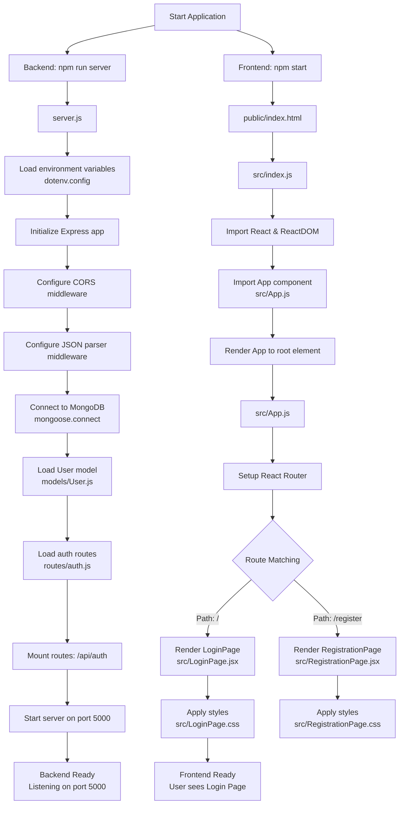
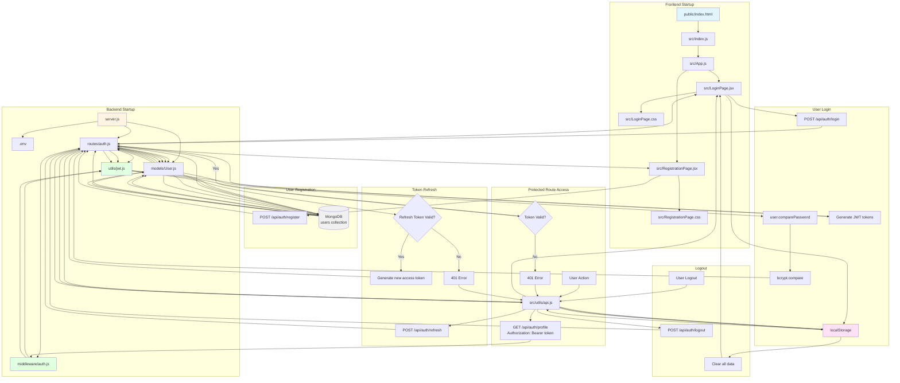

# Project Flow Chart - FIGMA React Demo

This document provides comprehensive flowcharts showing how the application works from startup to user interactions.

---

## Table of Contents
1. [Application Startup Flow](#application-startup-flow)
2. [Registration Flow](#registration-flow)
3. [Login Flow with JWT](#login-flow-with-jwt)
4. [Protected Route Access Flow](#protected-route-access-flow)
5. [Token Refresh Flow](#token-refresh-flow)
6. [Logout Flow](#logout-flow)
7. [Complete File Interaction Map](#complete-file-interaction-map)

---

## Application Startup Flow



---

## Registration Flow

```mermaid
graph TD
    A[User visits /register] --> B[Browser loads RegistrationPage.jsx]
    B --> C[User fills registration form<br/>Email, Password, Confirm Password]
    C --> D{Frontend Validation}

    D -->|Invalid| E[Display error message<br/>RegistrationPage.jsx]
    E --> C

    D -->|Valid| F[POST /api/auth/register<br/>Body: email, password]
    F --> G[Request reaches server.js]
    G --> H[Routes to routes/auth.js]
    H --> I[/register endpoint handler]

    I --> J{Backend Validation}
    J -->|Missing fields| K[Return 400 error<br/>Missing email/password]
    J -->|Valid| L[Check if user exists<br/>User.findOne]

    L --> M{User exists?}
    M -->|Yes| N[Return 400 error<br/>User already exists]
    M -->|No| O[Create new User instance<br/>models/User.js]

    O --> P[Pre-save hook triggers<br/>models/User.js]
    P --> Q[Hash password with bcrypt<br/>10 salt rounds]
    Q --> R[Save user to MongoDB<br/>Collection: users]

    R --> S[Return 201 success<br/>userId included]
    S --> T[RegistrationPage.jsx receives response]
    T --> U[Display success message]
    U --> V[Redirect to login page<br/>navigate '/']

    K --> W[Frontend receives error]
    N --> W
    W --> X[Display error alert]
```

---

## Login Flow with JWT

```mermaid
graph TD
    A[User visits / root] --> B[Browser loads LoginPage.jsx]
    B --> C[User enters credentials<br/>Email & Password]
    C --> D[User clicks LOGIN button]
    D --> E[POST /api/auth/login<br/>Body: email, password]

    E --> F[Request reaches server.js]
    F --> G[Routes to routes/auth.js]
    G --> H[/login endpoint handler]

    H --> I{Validation}
    I -->|Missing fields| J[Return 400 error]
    I -->|Valid| K[Find user in database<br/>User.findOne email]

    K --> L{User found?}
    L -->|No| M[Return 401 error<br/>Invalid credentials]
    L -->|Yes| N[Compare password<br/>user.comparePassword]

    N --> O[models/User.js method]
    O --> P[bcrypt.compare<br/>candidatePassword vs hashed]

    P --> Q{Password valid?}
    Q -->|No| M
    Q -->|Yes| R[Generate access token<br/>utils/jwt.js]

    R --> S[generateAccessToken userId<br/>Expires: 1 hour<br/>Secret: JWT_SECRET]
    S --> T[Generate refresh token<br/>utils/jwt.js]
    T --> U[generateRefreshToken userId<br/>Expires: 7 days<br/>Secret: JWT_REFRESH_SECRET]

    U --> V[Save refresh token to user<br/>user.refreshToken = token]
    V --> W[Save user to database]
    W --> X[Return 200 success response<br/>userId, email, accessToken, refreshToken]

    X --> Y[LoginPage.jsx receives response]
    Y --> Z{Login successful?}
    Z -->|Yes| AA[Store in localStorage<br/>accessToken<br/>refreshToken<br/>userId<br/>userEmail]
    Z -->|No| AB[Display error alert]

    AA --> AC[Display success alert]
    AC --> AD[Ready for authenticated requests]

    M --> AB
    J --> AB
```

---

## Protected Route Access Flow

```mermaid
graph TD
    A[User wants to access<br/>protected resource] --> B[Frontend calls<br/>src/utils/api.js]
    B --> C[authenticatedFetch function]
    C --> D[Get access token from localStorage<br/>getAccessToken]

    D --> E{Token exists?}
    E -->|No| F[Throw error<br/>No access token available]
    E -->|Yes| G[Add Authorization header<br/>Bearer accessToken]

    G --> H[Make fetch request<br/>GET /api/auth/profile]
    H --> I[Request reaches server.js]
    I --> J[Routes to routes/auth.js]
    J --> K[/profile endpoint<br/>WITH authMiddleware]

    K --> L[middleware/auth.js executes]
    L --> M[Extract Authorization header]
    M --> N{Header exists &<br/>starts with 'Bearer'?}

    N -->|No| O[Return 401 error<br/>No token provided]
    N -->|Yes| P[Extract token<br/>Remove 'Bearer ' prefix]

    P --> Q[Verify token<br/>utils/jwt.js]
    Q --> R[verifyAccessToken token<br/>jwt.verify JWT_SECRET]

    R --> S{Token valid?}
    S -->|No/Expired| T[Return 401 error<br/>Invalid or expired token]
    S -->|Yes| U[Decode token payload<br/>Extract userId]

    U --> V[Find user in database<br/>User.findById userId]
    V --> W{User exists?}
    W -->|No| X[Return 401 error<br/>User not found]
    W -->|Yes| Y[Attach user to request<br/>req.user = user<br/>req.userId = userId]

    Y --> Z[Call next<br/>Continue to route handler]
    Z --> AA[Route handler executes<br/>routes/auth.js /profile]
    AA --> AB[Access req.user data]
    AB --> AC[Return 200 success<br/>User profile data]

    AC --> AD[Response to frontend<br/>src/utils/api.js]
    AD --> AE{Status 200?}
    AE -->|Yes| AF[Return response to caller]
    AE -->|No - 401| AG[Token expired<br/>Trigger refresh flow]

    T --> AD
    O --> AD
    X --> AD
```

---

## Token Refresh Flow

```mermaid
graph TD
    A[Protected route returns 401] --> B[authenticatedFetch detects<br/>response.status === 401]
    B --> C[Call refreshAccessToken<br/>src/utils/api.js]

    C --> D[Get refresh token from localStorage<br/>getRefreshToken]
    D --> E{Refresh token exists?}

    E -->|No| F[Throw error<br/>No refresh token available]
    E -->|Yes| G[POST /api/auth/refresh<br/>Body: refreshToken]

    G --> H[Request reaches server.js]
    H --> I[Routes to routes/auth.js]
    I --> J[/refresh endpoint handler]

    J --> K{Refresh token provided?}
    K -->|No| L[Return 400 error<br/>Refresh token required]
    K -->|Yes| M[Verify refresh token<br/>utils/jwt.js]

    M --> N[verifyRefreshToken token<br/>jwt.verify JWT_REFRESH_SECRET]
    N --> O{Token valid?}

    O -->|No/Expired| P[Return 401 error<br/>Invalid refresh token]
    O -->|Yes| Q[Decode payload<br/>Extract userId]

    Q --> R[Find user in database<br/>User.findById userId]
    R --> S{User exists &<br/>token matches DB?}

    S -->|No| P
    S -->|Yes| T[Generate new access token<br/>utils/jwt.js]
    T --> U[generateAccessToken userId<br/>Expires: 1 hour]

    U --> V[Return 200 success<br/>New accessToken]
    V --> W[src/utils/api.js receives response]
    W --> X{Refresh successful?}

    X -->|Yes| Y[Store new token in localStorage<br/>setItem accessToken]
    X -->|No| Z[Clear localStorage]

    Y --> AA[Update Authorization header<br/>Bearer newAccessToken]
    AA --> AB[Retry original request]
    AB --> AC[Return response to caller]

    Z --> AD[Redirect to login page<br/>window.location.href = '/']
    Z --> AE[Throw error<br/>Session expired]

    F --> Z
    P --> W
    L --> W
```

---

## Logout Flow

```mermaid
graph TD
    A[User initiates logout] --> B[Call logout function<br/>src/utils/api.js]
    B --> C[Get userId from localStorage]
    C --> D{userId exists?}

    D -->|Yes| E[POST /api/auth/logout<br/>Body: userId]
    D -->|No| F[Skip backend call]

    E --> G[Request reaches server.js]
    G --> H[Routes to routes/auth.js]
    H --> I[/logout endpoint handler]

    I --> J{userId provided?}
    J -->|No| K[Return 400 error<br/>User ID required]
    J -->|Yes| L[Find user in database<br/>User.findById userId]

    L --> M{User found?}
    M -->|Yes| N[Set refreshToken to null<br/>user.refreshToken = null]
    M -->|No| O[Continue anyway]

    N --> P[Save user to database<br/>user.save]
    P --> Q[Return 200 success<br/>Logged out successfully]

    O --> Q
    Q --> R[Frontend receives response]
    R --> S[Clear all localStorage<br/>localStorage.clear]

    F --> S
    K --> S

    S --> T[Clear stored items:<br/>- accessToken<br/>- refreshToken<br/>- userId<br/>- userEmail]
    T --> U[Redirect to login<br/>window.location.href = '/']
    U --> V[User sees LoginPage<br/>Session terminated]
```

---

## Complete File Interaction Map



---

## Detailed Component Responsibilities

### **Frontend Files**

| File | Purpose | Called By | Calls | Achieves |
|------|---------|-----------|-------|----------|
| `public/index.html` | HTML template | Browser | - | Provides DOM root element for React |
| `src/index.js` | React entry point | index.html | App.js | Renders React app to DOM |
| `src/App.js` | Main component & routing | index.js | LoginPage.jsx, RegistrationPage.jsx | Sets up routes and navigation |
| `src/LoginPage.jsx` | Login UI component | App.js | API endpoint, utils/api.js | Handles user authentication, stores tokens |
| `src/RegistrationPage.jsx` | Registration UI | App.js | API endpoint | Handles user registration |
| `src/utils/api.js` | API utilities | Any component | Backend API, localStorage | Makes authenticated requests, handles token refresh |

### **Backend Files**

| File | Purpose | Called By | Calls | Achieves |
|------|---------|-----------|-------|----------|
| `server.js` | Server entry point | npm run server | All backend files | Initializes server, connects to DB, mounts routes |
| `models/User.js` | User data model | routes/auth.js | MongoDB, bcrypt | Defines user schema, hashes passwords, validates data |
| `routes/auth.js` | Auth endpoints | server.js | User.js, jwt.js, auth.js | Handles register, login, refresh, logout, profile |
| `utils/jwt.js` | JWT utilities | routes/auth.js, middleware/auth.js | jsonwebtoken | Generates and verifies JWT tokens |
| `middleware/auth.js` | Auth middleware | routes/auth.js | jwt.js, User.js | Protects routes, validates tokens, attaches user data |
| `.env` | Configuration | server.js, jwt.js | - | Stores environment variables and secrets |

### **Database**

| Collection | Used By | Stores | Purpose |
|------------|---------|--------|---------|
| `users` | models/User.js | email, password (hashed), refreshToken, createdAt | Stores user accounts and session tokens |

---

## File Execution Order

### **1. Application Start (Backend)**
```
1. server.js
2. .env (loaded by dotenv)
3. models/User.js
4. routes/auth.js
5. utils/jwt.js
6. middleware/auth.js
7. MongoDB connection
8. Server listening on port 5000
```

### **2. Application Start (Frontend)**
```
1. public/index.html
2. src/index.js
3. src/App.js
4. src/LoginPage.jsx (default route)
5. src/LoginPage.css
6. Browser renders login page
```

### **3. User Registration Flow**
```
1. src/RegistrationPage.jsx (user input)
2. POST /api/auth/register
3. server.js (receives request)
4. routes/auth.js (register handler)
5. models/User.js (create user)
6. bcrypt (hash password via pre-save hook)
7. MongoDB (save user)
8. routes/auth.js (send response)
9. src/RegistrationPage.jsx (handle response)
10. Navigate to src/LoginPage.jsx
```

### **4. User Login Flow**
```
1. src/LoginPage.jsx (user input)
2. POST /api/auth/login
3. server.js (receives request)
4. routes/auth.js (login handler)
5. models/User.js (find user)
6. MongoDB (query users)
7. models/User.js (comparePassword method)
8. bcrypt (compare passwords)
9. utils/jwt.js (generate tokens)
10. MongoDB (save refresh token)
11. routes/auth.js (send response with tokens)
12. src/LoginPage.jsx (receive response)
13. localStorage (store tokens)
```

### **5. Protected Route Access Flow**
```
1. Component/User action
2. src/utils/api.js (authenticatedFetch)
3. localStorage (get access token)
4. GET /api/auth/profile (with Bearer token)
5. server.js (receives request)
6. routes/auth.js (profile route)
7. middleware/auth.js (execute before handler)
8. utils/jwt.js (verify token)
9. models/User.js (find user)
10. MongoDB (query user)
11. middleware/auth.js (attach user to request)
12. routes/auth.js (profile handler)
13. Response sent to frontend
14. src/utils/api.js (receive response)
```

### **6. Token Refresh Flow**
```
1. src/utils/api.js (401 error detected)
2. localStorage (get refresh token)
3. POST /api/auth/refresh
4. server.js (receives request)
5. routes/auth.js (refresh handler)
6. utils/jwt.js (verify refresh token)
7. models/User.js (find user and verify token)
8. MongoDB (query user)
9. utils/jwt.js (generate new access token)
10. routes/auth.js (send new token)
11. src/utils/api.js (receive new token)
12. localStorage (store new token)
13. Retry original request
```

### **7. Logout Flow**
```
1. User action (logout button/function)
2. src/utils/api.js (logout function)
3. localStorage (get userId)
4. POST /api/auth/logout
5. server.js (receives request)
6. routes/auth.js (logout handler)
7. models/User.js (find user)
8. MongoDB (query and update user)
9. Clear refreshToken from database
10. routes/auth.js (send response)
11. src/utils/api.js (receive response)
12. localStorage (clear all data)
13. Redirect to src/LoginPage.jsx
```

---

## Data Flow Summary

### **1. Request Flow: Frontend → Backend**
```
Component → utils/api.js → localStorage → HTTP Request → server.js →
routes/auth.js → middleware/auth.js → utils/jwt.js → models/User.js → MongoDB
```

### **2. Response Flow: Backend → Frontend**
```
MongoDB → models/User.js → routes/auth.js → server.js → HTTP Response →
utils/api.js → localStorage → Component
```

### **3. Authentication Flow**
```
User Input → LoginPage → API Call → Auth Routes → JWT Utils →
Token Generation → Database Storage → Response → localStorage →
Authenticated State
```

### **4. Authorization Flow**
```
User Action → API Utils → Token from localStorage → Protected Route →
Auth Middleware → Token Verification → User Lookup → Access Granted →
Response
```

---

## Key Achievements by File

### **models/User.js**
✅ Defines user data structure
✅ Validates email format
✅ Ensures unique emails
✅ Automatically hashes passwords
✅ Provides password comparison method
✅ Stores refresh tokens

### **routes/auth.js**
✅ Handles user registration
✅ Manages user login
✅ Generates JWT tokens
✅ Refreshes expired tokens
✅ Handles logout
✅ Provides protected profile endpoint

### **utils/jwt.js**
✅ Generates access tokens (1 hour)
✅ Generates refresh tokens (7 days)
✅ Verifies token signatures
✅ Validates token expiration
✅ Uses environment variables for secrets

### **middleware/auth.js**
✅ Protects routes from unauthorized access
✅ Validates JWT tokens
✅ Checks user existence
✅ Attaches user data to requests
✅ Returns appropriate error codes

### **src/utils/api.js**
✅ Makes authenticated API requests
✅ Automatically includes Bearer tokens
✅ Handles token expiration (401 errors)
✅ Refreshes tokens automatically
✅ Manages localStorage
✅ Handles logout
✅ Redirects on session expiration

### **src/LoginPage.jsx**
✅ Provides login UI
✅ Validates user input
✅ Calls login API
✅ Stores tokens in localStorage
✅ Handles login errors
✅ Provides navigation to registration

### **server.js**
✅ Initializes Express application
✅ Loads environment variables
✅ Configures CORS
✅ Connects to MongoDB
✅ Loads all models and routes
✅ Starts the server

---

## Legend

- 📄 **File** - A project file
- 🔄 **Process** - A processing step
- 💾 **Storage** - Data storage (DB, localStorage)
- 🔒 **Auth** - Authentication/Authorization step
- ✅ **Success** - Successful outcome
- ❌ **Error** - Error handling
- 🔁 **Retry** - Retry mechanism
- 🚀 **Start** - Entry point
- 🎯 **End** - Final outcome

---

**Last Updated:** November 2025
**Project:** FIGMA React Demo - Login Application with JWT Authentication
